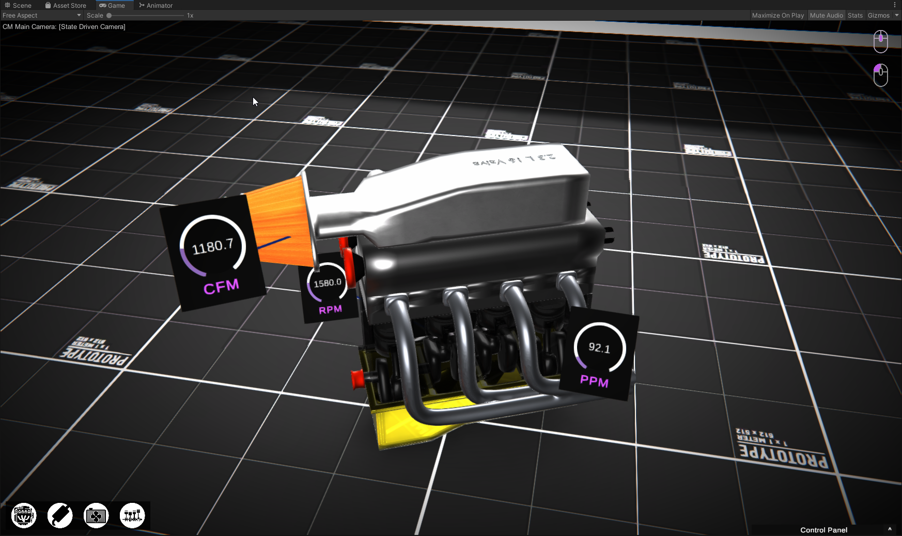

# Interactive Engine Model Viewer (interview project)
While applying for jobs, I was asked to create an interactive engine viewer in two days. 
I took this oppritunity to play around with HDRP and URP as well as Unity's Cinemachine.

# Links

How to use Cinemachine Inside a Model Viewer: https://connect.unity.com/p/creating-an-orbit-model-viewer-camera-using-cinemachine

# Images

